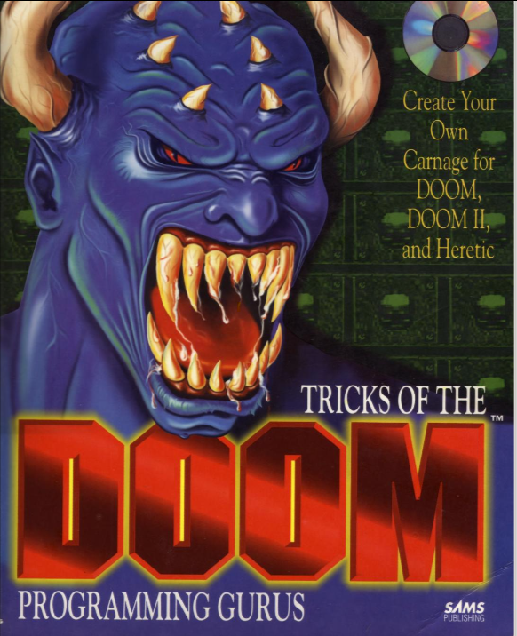
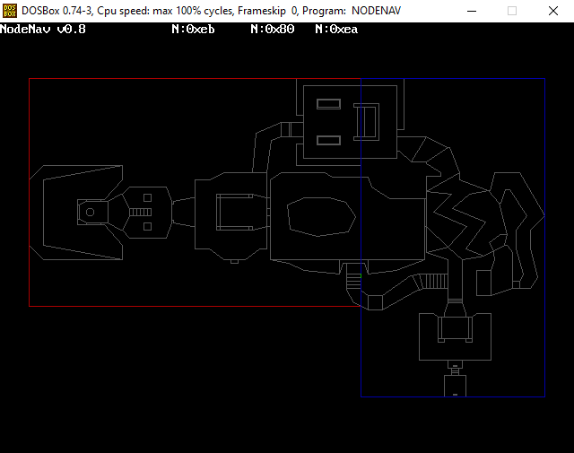
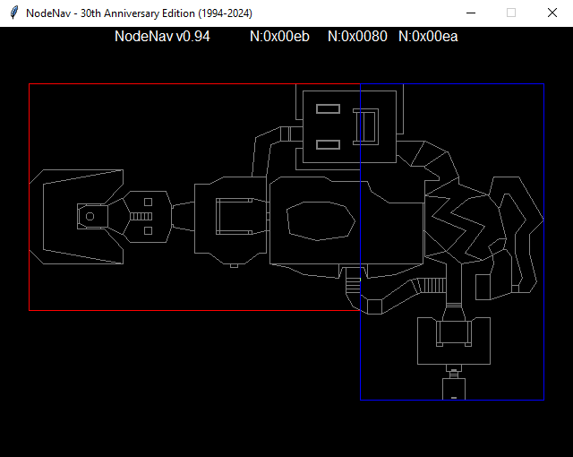

# nodenav

## Node Navigator for DOOM WAD files

This is the first piece of software I put on the internet, way back in 1994!
It originally ran on DOS, and was built with the Watcom C++ compiler and Borland BGI graphics

It was also distributed and featured in this book:
[Tricks of the DOOM Programmining Gurus](https://archive.org/details/tricks-of-the-doom-programming-gurus)

For it's 30th anniversary, I ported it to Python using John Zelle's graphics.py.
It works great!

## Original Version:

## Python Version:

